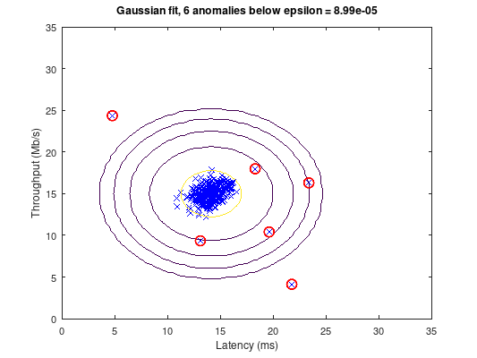

# Computational modelling (MATLAB / Octave)

Coursework from the Computational Modelling course at PUCPR (2019): probability distributions, sampling, hypothesis testing, regression and anomaly detection, worked in MATLAB/Octave and Excel. All scripts are in English and were run end to end in GNU Octave 9.4; the ones that call Statistics-toolbox functions are marked below and need MATLAB's Statistics Toolbox or Octave's `statistics` package.



## Anomaly detection (`anomaly-detection/`)

The main project: detect failing servers from their latency and throughput. A Gaussian model is fitted to the training data, a probability threshold `epsilon` is chosen on a labelled cross-validation set by maximising the F1 score, and every point whose density falls below `epsilon` is flagged.

| File | What it is |
| --- | --- |
| `detect_anomalies.m` | Runs the whole pipeline on the two-feature set (plotted above) and then on an eleven-feature set. A flag switches between independent features (diagonal covariance) and a full covariance matrix. |
| `estimate_gaussian.m`, `estimate_gaussian_full.m` | Per-feature mean/variance, or mean vector plus full covariance. |
| `multivariate_gaussian.m` | Density of the multivariate normal; works with a vector of variances or a covariance matrix. |
| `select_threshold.m` | Scans 1000 candidate thresholds and keeps the best F1 (true/false positives and false negatives computed explicitly). |
| `visualize_fit.m` | Scatter plot with the density level curves. |
| `network_data.mat`, `network_data2.mat` | The two datasets (307 x 2 and 1000 x 11 training points with labelled validation sets). |

```
>> detect_anomalies
Best epsilon found by cross-validation: 8.990853e-05
Best F1 on the cross-validation set:    0.875000
Anomalies found in the training set: 6
...
Best epsilon found by cross-validation: 1.377229e-18
Best F1 on the cross-validation set:    0.615385
Anomalies found in the training set:    117
```

No toolbox is needed for this folder.

## Simulations vs closed forms (`simulations/`)

Each experiment estimates a probability by Monte Carlo simulation and prints the exact answer next to it; several come in a loop version and a vectorised version to compare running times.

| File | Question answered | Needs Statistics toolbox |
| --- | --- | --- |
| `random-walk/` | Probability that a walk of `n` steps (+1/-1) ends at position `k`: `C(n, (n+k)/2) / 2^n` vs simulation. `random_walk.m` is the interactive driver. | no |
| `birthday-problem/` | Probability that two people in a group of `k` share a birthday, exact product vs simulation. | no |
| `dice_probability.m` | Four throws of a die: the only six is the fourth one (exact 0.0965). | no |
| `sum_of_exponentials_cdf*.m` | P(sum of `n` exponentials < x), simulated vs the Gamma CDF. | yes |
| `exponential_comparison*.m` | P(X1 < X2) for two exponentials, simulated vs `l1 / (l1 + l2)`. | yes |

## Random variables (`random-variables/`)

| File | What it is | Needs Statistics toolbox |
| --- | --- | --- |
| `exponential_random.m` | Exponential generator by the inverse-transform method. | no |
| `poisson_random.m` | Poisson generator by walking up the cumulative distribution. | no |
| `*_pdf_vs_histogram.m` | Binomial, Poisson, exponential and normal: histogram of simulated values overlaid on the theoretical pdf/pmf. | yes |
| `geometric_pdf_bar.m` | Bar chart of the geometric distribution. | yes |

## Naive Bayes classifier (`naive-bayes/`)

A from-scratch naive Bayes classifier for the classic "does the customer buy a computer?" table (age, income, student, credit). `classify_examples.m` loads `training_data.m` and classifies two customers, printing the per-feature conditional probabilities and the class posteriors:

```
x = [1  2  1  1]
  P(x|c) P(c) per class: 0.028219    0.010286
  predicted class: 1
x = [3  2  2  1]
  P(x|c) P(c) per class: 0.021164    0.027429
  predicted class: 2
```

## Least squares and basics

- `least-squares/ols_example.m`: multiple regression coefficients from the normal equations and from the backslash operator, with R².
- `basics/`: first exercises (a factorial loop, a sine plot).

## Documents (`documents/`)

Written in Portuguese, as submitted. `team-worksheets/` holds the in-class problem sets (numbered as in the course) on distributions, descriptive statistics, confidence intervals, hypothesis tests, correlation, regression, Bayes' theorem and the naive Bayes classifier; the `tde-*` files are the graded assignments (random-walk questionnaire, descriptive statistics and linear regression spreadsheets), and the remaining spreadsheets are the regression/correlation calculations done by hand in Excel.
